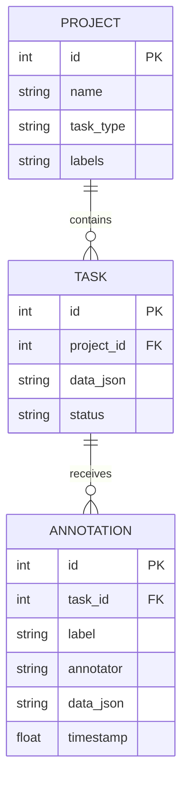

# LLM Annotation Studio

Este subproyecto forma parte de la infraestructura modular de Inteligencia Artificial ai-core-infra. Implementa una plataforma web interactiva completa (Full-Stack local) para el etiquetado y anotacion de datos orientada al entrenamiento de modelos de lenguaje, permitiendo flujos de trabajo eficientes para tareas clasicas de Procesamiento del Lenguaje Natural (PLN) y alineacion con humanos (Human-in-the-Loop).

Para este sistema se desarrollo una aplicacion de una sola pagina (SPA) que se conecta con un backend en FastAPI y una base de datos relacional SQLite para el almacenamiento estructurado y seguro de las anotaciones locales, facilitando la posterior exportacion para el ajuste fino de modelos.

## Arquitectura de Datos y Relaciones

El backend utiliza SQLAlchemy para gestionar la integridad referencial y de claves foraneas en una base de datos local SQLite. La estructura de relaciones se representa mediante el siguiente diagrama de Entidad-Relacion:



## Especificacion de Modos de Anotacion

### 1. Clasificacion de Texto
Etiquetado categorico simple. El anotador selecciona una de las etiquetas del proyecto para asociarla a la tarea.

### 2. Alineacion Comparativa (DPO/RLHF)
La tarea contiene dos outputs generados por LLMs en base a un prompt. El anotador registra:
*   Preferencia (Respuesta A o B).
*   Calificacion ordinal de cada respuesta (de 1 a 5 estrellas).
*   Respuesta dorada (Golden Response): Edicion directa en pantalla para refinar la mejor respuesta posible.

### 3. Reconocimiento de Entidades Nombradas (NER)
Anotador basado en la seleccion en el DOM. Registra indices fisicos absolutos de caracteres sobre el texto:

$$\text{Annotation} = [S_{\text{start}}, S_{\text{end}}, L_{\text{label}}, T_{\text{text}}]$$

Donde $S_{\text{start}}$ es el offset inicial inclusivo, $S_{\text{end}}$ es el offset final exclusivo, $L_{\text{label}}$ es la categoria asignada, y $T_{\text{text}}$ es la subcadena seleccionada para auditoria.

## Especificacion de la API REST (Endpoints principales)

| Metodo | Ruta | Descripcion |
| :--- | :--- | :--- |
| `POST` | `/api/projects` | Crea un proyecto con su configuracion de etiquetas y tipo de tarea. |
| `GET` | `/api/projects` | Lista todos los proyectos activos en base de datos. |
| `GET` | `/api/projects/{id}/tasks` | Recupera todas las tareas (pendientes y anotadas) asociadas a un proyecto. |
| `POST` | `/api/projects/{id}/tasks` | Carga tareas de forma masiva enviando una coleccion JSON de registros. |
| `POST` | `/api/tasks/{id}/annotations` | Registra una nueva anotacion in situ, marcando la tarea como completada. |
| `GET` | `/api/projects/{id}/export` | Exporta el dataset en formato adecuado para entrenamiento (ej. pares DPO o tuplas NER). |
| `GET` | `/api/tokenize` | Endpoint de interaccion que recibe un texto y devuelve el conteo de tokens mediante el modulo vecino. |

## Requisitos de Instalacion

*   Python 3.10 o superior
*   FastAPI
*   SQLAlchemy
*   Uvicorn
*   HTTPX (para pruebas de integracion)

Para instalar los requisitos del servidor web, ejecute:
```bash
pip install -r requirements.txt
```

## Guia de Ejecucion y Verificacion

### 1. Iniciar Servidor Local
```bash
python3 main.py
```
El servidor estara disponible en el puerto 8000. Acceda a `http://127.0.0.1:8000` en su navegador.

### 2. Ejecutar Pruebas Unitarias
El proyecto cuenta con cobertura de pruebas unitarias locales para validar el comportamiento del API y la base de datos relacional sobre un entorno temporal aislado:
```bash
python3 -m unittest test_main.py
```

## Conectividad en el Ecosistema ai-core-infra

El `llm-annotation-studio` actua como el nodo de curacion humana:
*   Consume a [bpe-tokenizer-from-scratch](https://github.com/juanmmm21/bpe-tokenizer-from-scratch) mediante `/api/tokenize` para mostrar al anotador el conteo y distribucion fisica de tokens del texto.
*   El dataset JSON exportado sirve de alimentacion para el ajuste fino en [llm-qlora-finetuner](https://github.com/juanmmm21/llm-qlora-finetuner).
*   Los datos anotados y validados alimentan el arnes de evaluacion automatizado de [llm-eval-harness](https://github.com/juanmmm21/llm-eval-harness) para medir regresiones.
